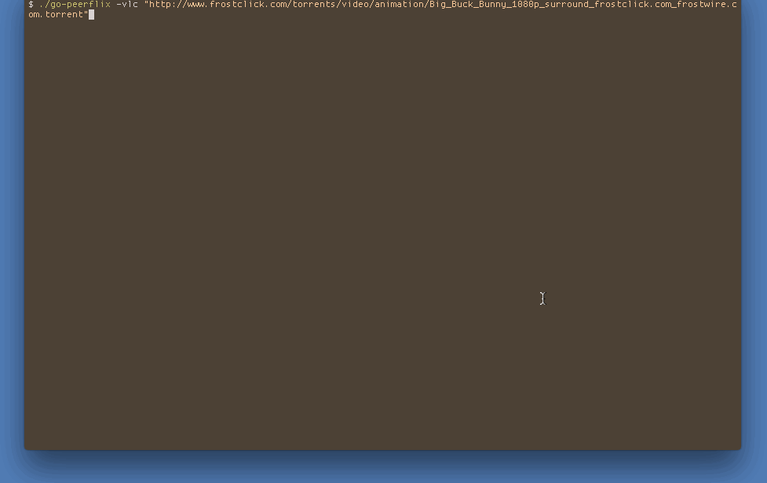

# Go Peerflix

A Golang port of [peerflix](https://github.com/mafintosh/peerflix).


Start watching the movie while your torrent is still downloading!


## Installation
```sh
go get github.com/Sioro-Neoku/go-peerflix
```

## Usage
Access the stream on [http://localhost:8080/](http://localhost:8080/)
```sh
go-peerflix [magnet url|torrent path|torrent url]
```

To start playing in VLC (OsX only):
```sh
go-peerflix -vlc [magnet url|torrent path|torrent url]
```

## License
[MIT](https://raw.githubusercontent.com/Sioro-Neoku/go-peerflix/master/LICENSE)
